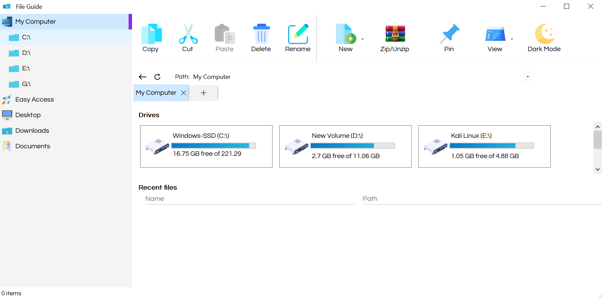

<h1 align="center">
  <br>
  
  <br>
  FileGuide
  <br>
</h1>

<h4 align="center">A desktop application for managing filesystem</h4>

<p align="center">
    
    
    
</p>

<p align="center">
  <a href="#key-features">Key Features</a> •
  <a href="#how-to-use">How To Use</a> •
  <a href="#credits">Credits</a> •
  <a href="#authors">Authors</a> •
  <a href="#acknowledgements">Acknowledgements</a>
</p>



## Key Features

* Managing directory tree
* Viewing folders' content
* Managing disks and recently accessed files
* Interaction with files and folders: cut, copy, paste, delete, zip & unzip, pin
* Dark Mode
* Creating and switching between tabs

## How To Use

To clone and run this application, you'll need [Git](https://git-scm.com) and [Visual Studio](https://visualstudio.microsoft.com/downloads/) installed on your computer. From your command line:

```bash
# Clone this repository
$ git clone https://github.com/Doan-Pham/FileGuide
```
Then open FileGuide.sln at the root directory, click Start (F5) to run the program.

## Credits

This software uses the following resources and packages:

- Accessing special folders: [KnownFolders](https://gitlab.com/Syroot/KnownFolders)
- Icons: [FontAwesome](https://fontawesome.com/icons), [Flaticon](https://www.flaticon.com/icons)

## Authors

  - [**Pham Truong Hai Doan**](https://github.com/Doan-Pham)
  
## Acknowledgements
  - This software takes inspiration from the following products: File Explorer (Windows 10), [Files](https://files.community/), [XYPlorer](https://www.xyplorer.com/)
